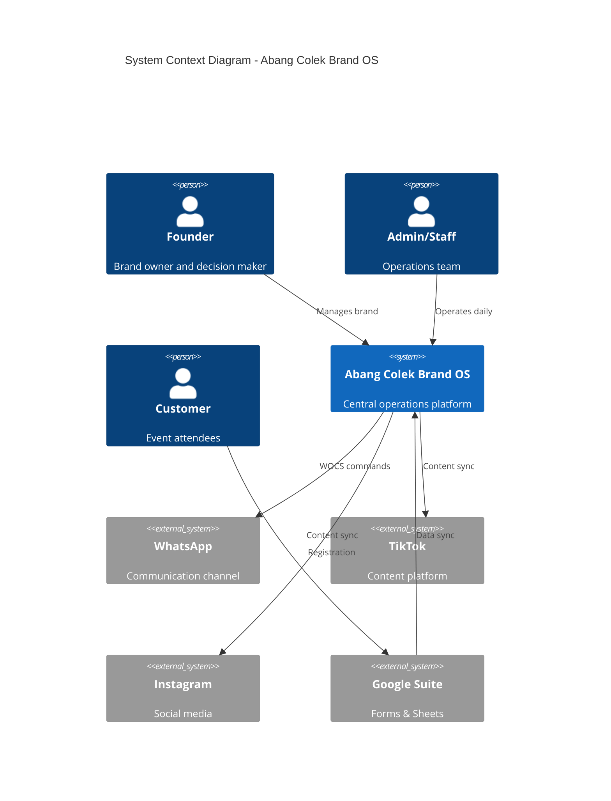
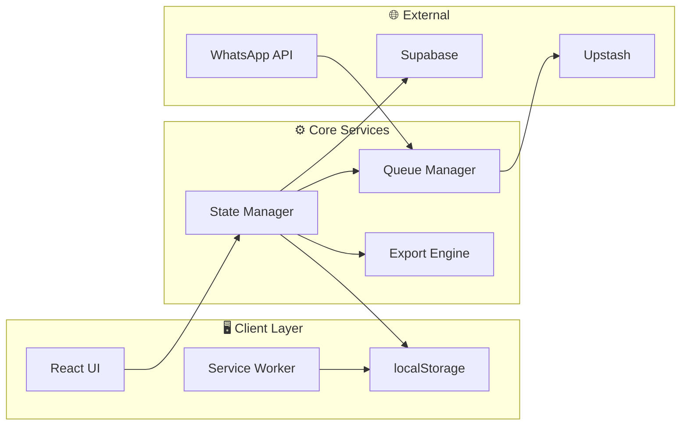
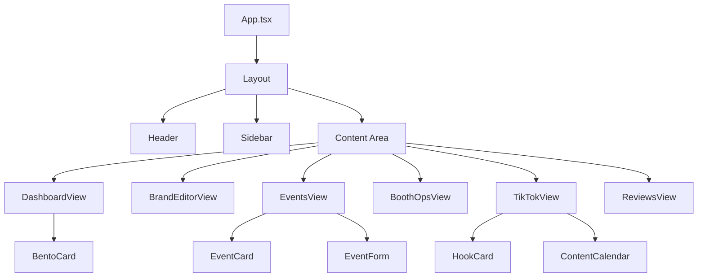
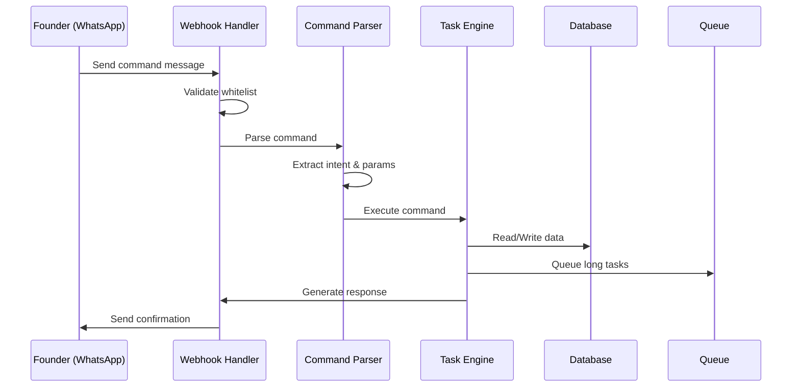
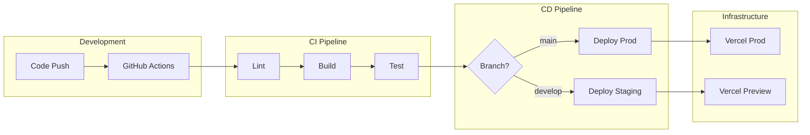

# 🌶️ Architecture: Abang Colek Brand OS

> **"Rasa Padu, Pedas Menggamit"** - by Liurleleh House

**Version:** 2.0  
**Last Updated:** 2026-01-17  
**Status:** Active

---

## 📋 Table of Contents

1. [System Overview](#1-system-overview)
2. [Architecture Principles](#2-architecture-principles)
3. [High-Level Architecture](#3-high-level-architecture)
4. [Component Architecture](#4-component-architecture)
5. [Data Architecture](#5-data-architecture)
6. [Integration Architecture](#6-integration-architecture)
7. [Security Architecture](#7-security-architecture)
8. [Deployment Architecture](#8-deployment-architecture)
9. [Operational Architecture](#9-operational-architecture)
10. [Future State Architecture](#10-future-state-architecture)

---

## 1. System Overview

### 1.1 Purpose

Abang Colek Brand OS is a comprehensive business management platform designed to centralize and streamline all operational aspects of the Abang Colek street food brand.

### 1.2 System Context



### 1.3 Key Capabilities

| Capability | Description | Module |
| ---------- | ----------- | ------ |
| **Brand Management** | Centralized brand assets | Brand Editor |
| **Event Operations** | End-to-end event lifecycle | Event Pipeline |
| **Content Engine** | TikTok-first content planning | TikTok Engine |
| **Booth Operations** | Checklists and logistics | Booth Ops |
| **Performance Analytics** | KPI tracking and insights | Reviews |
| **Remote Control** | WhatsApp-based commands | WOCS |

---

## 2. Architecture Principles

### 2.1 Core Principles

| Principle | Description | Implementation |
| --------- | ----------- | -------------- |
| **Offline-First** | Work without internet | PWA + localStorage |
| **Mobile-Ready** | Touch-optimized UI | Responsive design |
| **Single Source of Truth** | Centralized data | Unified data model |
| **Extensible** | Easy to add features | Modular components |
| **Cost-Effective** | Minimize infrastructure | FREE tier stack |

### 2.2 Design Patterns

| Pattern | Use Case | Implementation |
| ------- | -------- | -------------- |
| **Component-Based** | UI structure | React components |
| **State Management** | Data flow | React hooks + Context |
| **Repository Pattern** | Data access | Service layer |
| **Command Pattern** | WOCS operations | Command parser |
| **Observer Pattern** | Real-time updates | Event emitters |

### 2.3 Technology Decisions

| Decision | Choice | Rationale |
| -------- | ------ | --------- |
| **Framework** | React 19 | Modern, ecosystem |
| **Language** | TypeScript | Type safety |
| **Build Tool** | Vite 7 | Fast, modern |
| **Styling** | Tailwind CSS | Utility-first |
| **Storage** | localStorage → Supabase | Progressive enhancement |

---

## 3. High-Level Architecture

### 3.1 System Architecture

```text
┌─────────────────────────────────────────────────────────────────────────────┐
│                              PRESENTATION LAYER                              │
│  ┌─────────────────┐  ┌─────────────────┐  ┌─────────────────┐             │
│  │   Web App (PWA) │  │  WhatsApp (WOCS)│  │  Future: Mobile │             │
│  └────────┬────────┘  └────────┬────────┘  └────────┬────────┘             │
└───────────┼─────────────────────┼─────────────────────┼─────────────────────┘
            │                     │                     │
            ▼                     ▼                     ▼
┌─────────────────────────────────────────────────────────────────────────────┐
│                              APPLICATION LAYER                               │
│  ┌─────────────┐  ┌─────────────┐  ┌─────────────┐  ┌─────────────┐        │
│  │   Brand     │  │   Event     │  │   TikTok    │  │   Booth     │        │
│  │   Module    │  │   Module    │  │   Module    │  │   Module    │        │
│  └─────────────┘  └─────────────┘  └─────────────┘  └─────────────┘        │
│  ┌─────────────┐  ┌─────────────┐  ┌─────────────┐  ┌─────────────┐        │
│  │   Review    │  │   WOCS      │  │   Auth      │  │   Export    │        │
│  │   Module    │  │   Module    │  │   Module    │  │   Module    │        │
│  └─────────────┘  └─────────────┘  └─────────────┘  └─────────────┘        │
└─────────────────────────────────────────────────────────────────────────────┘
            │                     │                     │
            ▼                     ▼                     ▼
┌─────────────────────────────────────────────────────────────────────────────┐
│                                SERVICE LAYER                                 │
│  ┌─────────────┐  ┌─────────────┐  ┌─────────────┐  ┌─────────────┐        │
│  │   Storage   │  │   Queue     │  │   Sync      │  │   API       │        │
│  │   Service   │  │   Service   │  │   Service   │  │   Gateway   │        │
│  └─────────────┘  └─────────────┘  └─────────────┘  └─────────────┘        │
└─────────────────────────────────────────────────────────────────────────────┘
            │                     │                     │
            ▼                     ▼                     ▼
┌─────────────────────────────────────────────────────────────────────────────┐
│                                 DATA LAYER                                   │
│  ┌─────────────────────┐  ┌─────────────────────┐  ┌───────────────────┐   │
│  │   localStorage      │  │   Supabase          │  │   Upstash Redis   │   │
│  │   (Current)         │  │   (Planned)         │  │   (Queue)         │   │
│  └─────────────────────┘  └─────────────────────┘  └───────────────────┘   │
└─────────────────────────────────────────────────────────────────────────────┘
```

### 3.2 Data Flow Architecture



---

## 4. Component Architecture

### 4.1 Frontend Components

```text
src/
├── components/
│   ├── layout/
│   │   ├── Header.tsx           # App header with nav
│   │   ├── Sidebar.tsx          # Module navigation
│   │   ├── Footer.tsx           # App footer
│   │   └── Layout.tsx           # Main layout wrapper
│   │
│   ├── features/
│   │   ├── DashboardView.tsx    # Bento dashboard
│   │   ├── BrandEditorView.tsx  # Brand content editor
│   │   ├── EventsView.tsx       # Event pipeline
│   │   ├── BoothOpsView.tsx     # Checklists & prep
│   │   ├── TikTokView.tsx       # Content engine
│   │   └── ReviewsView.tsx      # Performance tracking
│   │
│   ├── shared/
│   │   ├── Button.tsx           # Reusable button
│   │   ├── Card.tsx             # Content card
│   │   ├── Modal.tsx            # Dialog modal
│   │   ├── Input.tsx            # Form input
│   │   └── Table.tsx            # Data table
│   │
│   └── providers/
│       ├── ThemeProvider.tsx    # Dark/light mode
│       ├── DataProvider.tsx     # Global state
│       └── ToastProvider.tsx    # Notifications
│
├── hooks/
│   ├── useLocalStorage.ts       # Persistent state
│   ├── useDebounce.ts           # Debounced values
│   ├── useKeyboard.ts           # Keyboard shortcuts
│   └── useExport.ts             # Export utilities
│
├── lib/
│   ├── storage.ts               # Storage abstraction
│   ├── exporters.ts             # Export functions
│   ├── validators.ts            # Data validation
│   └── utils.ts                 # General utilities
│
└── types/
    ├── brand.ts                 # Brand data types
    ├── event.ts                 # Event types
    ├── content.ts               # Content types
    └── index.ts                 # Main exports
```

### 4.2 Component Hierarchy



### 4.3 State Management

```text
┌─────────────────────────────────────────────────────────────────┐
│                        React Context                             │
│  ┌─────────────────────────────────────────────────────────────┐│
│  │                     DataContext                              ││
│  │  ┌──────────┐  ┌──────────┐  ┌──────────┐  ┌──────────┐   ││
│  │  │ brand    │  │ events   │  │ content  │  │ settings │   ││
│  │  └──────────┘  └──────────┘  └──────────┘  └──────────┘   ││
│  └─────────────────────────────────────────────────────────────┘│
│                              │                                   │
│                              ▼                                   │
│  ┌─────────────────────────────────────────────────────────────┐│
│  │                   Actions / Reducers                         ││
│  │  updateBrand() | addEvent() | saveContent() | exportData()  ││
│  └─────────────────────────────────────────────────────────────┘│
│                              │                                   │
│                              ▼                                   │
│  ┌─────────────────────────────────────────────────────────────┐│
│  │                      Persistence                             ││
│  │              localStorage (debounced, versioned)             ││
│  └─────────────────────────────────────────────────────────────┘│
└─────────────────────────────────────────────────────────────────┘
```

---

## 5. Data Architecture

### 5.1 Entity Relationship Diagram

```mermaid
erDiagram
    BRAND ||--o{ EVENT : "hosts"
    BRAND ||--o{ CONTENT : "creates"
    BRAND ||--|| SETTINGS : "has"

    EVENT ||--o{ CHECKLIST : "requires"
    EVENT ||--o{ CONTENT : "generates"
    EVENT ||--o{ REVIEW : "receives"
    EVENT ||--o{ EO_CONTACT : "booked_by"

    CONTENT ||--o{ HOOK : "uses"
    CONTENT ||--o{ SHOT : "contains"

    BRAND {
        string id PK
        string name
        string tagline
        string manifesto
        json deck
        json song
        json sop
        timestamp updated_at
    }

    EVENT {
        string id PK
        string name
        string location
        date start_date
        date end_date
        string status
        json fees
        json requirements
        timestamp created_at
    }

    CONTENT {
        string id PK
        string event_id FK
        string hook_id FK
        string caption
        string platform
        date scheduled_at
        string status
    }

    HOOK {
        string id PK
        string title
        string description
        array tags
        number uses
    }

    CHECKLIST {
        string id PK
        string event_id FK
        string type
        array items
        boolean completed
    }

    REVIEW {
        string id PK
        string event_id FK
        json kpis
        string notes
        timestamp created_at
    }
```



### 5.2 Data Models

```typescript
// Core Types
interface BrandOSData {
  version: string;
  brand: BrandProfile;
  events: Event[];
  content: ContentPlan[];
  hooks: Hook[];
  settings: Settings;
  metadata: Metadata;
}

interface BrandProfile {
  id: string;
  name: string;
  tagline: string;
  manifesto: string;
  deck: DeckSlide[];
  song: SongLyrics;
  sop: SOPDocument[];
  colors: ColorPalette;
  assets: AssetLibrary;
}

interface Event {
  id: string;
  name: string;
  location: Location;
  dates: DateRange;
  status: EventStatus;
  eo: EOContact;
  fees: FeeStructure;
  checklists: Checklist[];
  content: ContentPlan[];
  review?: EventReview;
}

interface ContentPlan {
  id: string;
  eventId: string;
  platform: 'tiktok' | 'instagram' | 'facebook';
  hook: Hook;
  caption: string;
  shots: Shot[];
  scheduledAt: Date;
  status: ContentStatus;
}
```

### 5.3 Storage Strategy

| Phase | Storage | Sync | Backup |
| ----- | ------- | ---- | ------ |
| **MVP** | localStorage | None | Manual JSON export |
| **WOCS** | localStorage + Supabase | Real-time | Auto cloud backup |
| **Scale** | Supabase primary | Multi-device | Continuous |

---

## 6. Integration Architecture

### 6.1 Integration Map

```text
┌─────────────────────────────────────────────────────────────────────────────┐
│                          INTEGRATION LAYER                                   │
├─────────────────────────────────────────────────────────────────────────────┤
│                                                                              │
│   ┌─────────────┐    ┌─────────────┐    ┌─────────────┐    ┌─────────────┐│
│   │  WhatsApp   │    │   TikTok    │    │  Instagram  │    │   Google    ││
│   │  Cloud API  │    │   (Manual)  │    │  Graph API  │    │   Suite     ││
│   └──────┬──────┘    └──────┬──────┘    └──────┬──────┘    └──────┬──────┘│
│          │                  │                  │                  │        │
│          ▼                  ▼                  ▼                  ▼        │
│   ┌──────────────────────────────────────────────────────────────────────┐ │
│   │                        ADAPTER LAYER                                  │ │
│   │  ┌────────────┐  ┌────────────┐  ┌────────────┐  ┌────────────┐     │ │
│   │  │ WhatsApp   │  │ Content    │  │ Social     │  │ Data       │     │ │
│   │  │ Adapter    │  │ Adapter    │  │ Adapter    │  │ Adapter    │     │ │
│   │  └────────────┘  └────────────┘  └────────────┘  └────────────┘     │ │
│   └──────────────────────────────────────────────────────────────────────┘ │
│                                  │                                         │
│                                  ▼                                         │
│   ┌──────────────────────────────────────────────────────────────────────┐ │
│   │                    ABANG COLEK BRAND OS                               │ │
│   └──────────────────────────────────────────────────────────────────────┘ │
└─────────────────────────────────────────────────────────────────────────────┘
```

### 6.2 WOCS Architecture



### 6.3 API Contracts

| Integration | Protocol | Auth | Rate Limit |
| ----------- | -------- | ---- | ---------- |
| **WhatsApp Cloud API** | REST + Webhooks | Bearer Token | 1000/sec |
| **Supabase** | REST + Realtime | API Key | 1000/min |
| **Upstash Redis** | REST | API Key | 10000/sec |
| **Google Forms** | REST | API Key | 100/min |

---

## 7. Security Architecture

### 7.1 Security Layers

```text
┌─────────────────────────────────────────────────────────────────────────────┐
│                            SECURITY LAYERS                                   │
├─────────────────────────────────────────────────────────────────────────────┤
│                                                                              │
│  Layer 1: Authentication                                                     │
│  ┌───────────────────────────────────────────────────────────────────────┐  │
│  │  • WhatsApp phone whitelist                                            │  │
│  │  • Session tokens (future)                                             │  │
│  │  • OAuth for integrations                                              │  │
│  └───────────────────────────────────────────────────────────────────────┘  │
│                                                                              │
│  Layer 2: Authorization                                                      │
│  ┌───────────────────────────────────────────────────────────────────────┐  │
│  │  • Role-based access (Founder, Admin, Editor, Viewer)                  │  │
│  │  • Command permission matrix                                           │  │
│  │  • Data scope restrictions                                             │  │
│  └───────────────────────────────────────────────────────────────────────┘  │
│                                                                              │
│  Layer 3: Data Protection                                                    │
│  ┌───────────────────────────────────────────────────────────────────────┐  │
│  │  • Client-side encryption (localStorage)                               │  │
│  │  • TLS for all API calls                                               │  │
│  │  • Token encryption at rest                                            │  │
│  └───────────────────────────────────────────────────────────────────────┘  │
│                                                                              │
│  Layer 4: Audit & Compliance                                                 │
│  ┌───────────────────────────────────────────────────────────────────────┐  │
│  │  • Action logging                                                      │  │
│  │  • Change history                                                      │  │
│  │  • PDPA compliance                                                     │  │
│  └───────────────────────────────────────────────────────────────────────┘  │
└─────────────────────────────────────────────────────────────────────────────┘
```

### 7.2 Role Matrix

| Role | View | Edit | Export | Admin | WOCS |
| ---- | ---- | ---- | ------ | ----- | ---- |
| **Founder** | ✅ | ✅ | ✅ | ✅ | ✅ |
| **Admin** | ✅ | ✅ | ✅ | ⚠️ | ✅ |
| **Editor** | ✅ | ✅ | ❌ | ❌ | ❌ |
| **Viewer** | ✅ | ❌ | ❌ | ❌ | ❌ |

---

## 8. Deployment Architecture

### 8.1 Infrastructure

```text
┌─────────────────────────────────────────────────────────────────────────────┐
│                         DEPLOYMENT ARCHITECTURE                              │
├─────────────────────────────────────────────────────────────────────────────┤
│                                                                              │
│    ┌───────────────────────────────────────────────────────────────────┐    │
│    │                         VERCEL (FREE)                              │    │
│    │  ┌─────────────────┐  ┌─────────────────┐  ┌─────────────────┐   │    │
│    │  │   Static Site   │  │   Edge Funcs    │  │   API Routes    │   │    │
│    │  │   (React PWA)   │  │   (WOCS)        │  │   (Webhooks)    │   │    │
│    │  └─────────────────┘  └─────────────────┘  └─────────────────┘   │    │
│    └───────────────────────────────────────────────────────────────────┘    │
│                                        │                                     │
│    ┌───────────────────────────────────┼───────────────────────────────┐    │
│    │                                   ▼                                │    │
│    │                         SUPABASE (FREE)                            │    │
│    │  ┌─────────────────┐  ┌─────────────────┐  ┌─────────────────┐   │    │
│    │  │   PostgreSQL    │  │   Auth          │  │   Storage       │   │    │
│    │  │   Database      │  │   Service       │  │   (Assets)      │   │    │
│    │  └─────────────────┘  └─────────────────┘  └─────────────────┘   │    │
│    └───────────────────────────────────────────────────────────────────┘    │
│                                        │                                     │
│    ┌───────────────────────────────────┼───────────────────────────────┐    │
│    │                                   ▼                                │    │
│    │                         UPSTASH (FREE)                             │    │
│    │  ┌─────────────────┐  ┌─────────────────┐                         │    │
│    │  │   Redis         │  │   QStash        │                         │    │
│    │  │   (Cache/Queue) │  │   (Scheduler)   │                         │    │
│    │  └─────────────────┘  └─────────────────┘                         │    │
│    └───────────────────────────────────────────────────────────────────┘    │
│                                                                              │
└─────────────────────────────────────────────────────────────────────────────┘
```

### 8.2 Environment Strategy

| Environment | Purpose | URL | Database |
| ----------- | ------- | --- | -------- |
| **Development** | Local development | localhost:5173 | localStorage |
| **Staging** | Testing before prod | staging.abangcolek.com | Supabase (dev) |
| **Production** | Live users | app.abangcolek.com | Supabase (prod) |

### 8.3 CI/CD Pipeline



---

## 9. Operational Architecture

### 9.1 Monitoring

| Metric | Tool | Alert Threshold |
| ------ | ---- | --------------- |
| **Uptime** | Vercel Analytics | <99.9% |
| **Error Rate** | Sentry | >1% |
| **Response Time** | Vercel | >500ms |
| **Storage Usage** | Supabase | >80% |

### 9.2 Logging

```text
Log Levels:
├── ERROR   → Critical failures (Sentry)
├── WARN    → Potential issues (Console)
├── INFO    → Key operations (Console)
└── DEBUG   → Detailed tracing (Dev only)
```

### 9.3 Backup Strategy

| Data | Frequency | Retention | Method |
| ---- | --------- | --------- | ------ |
| **Database** | Daily | 30 days | Supabase auto |
| **User Data** | On change | Versioned | JSON export |
| **Assets** | Weekly | 90 days | Cloud storage |

---

## 10. Future State Architecture

### 10.1 Evolution Roadmap

```text
Phase 1 (Current)     Phase 2 (Q2 2026)    Phase 3 (Q4 2026)    Phase 4 (2027)
┌─────────────────┐   ┌─────────────────┐  ┌─────────────────┐  ┌─────────────────┐
│  localStorage   │   │  + Supabase     │  │  + Multi-tenant │  │  + AI/ML        │
│  + PWA          │ → │  + WOCS         │→ │  + Team Collab  │→ │  + Predictions  │
│  + Exports      │   │  + Webhooks     │  │  + Analytics    │  │  + Automation   │
└─────────────────┘   └─────────────────┘  └─────────────────┘  └─────────────────┘
```

### 10.2 Scalability Plan

| Dimension | Current | Target | Strategy |
| --------- | ------- | ------ | -------- |
| **Users** | 1-5 | 50+ | Multi-tenant |
| **Events** | 10/month | 100/month | Database scaling |
| **Storage** | 5MB | 1GB+ | Cloud storage |
| **Regions** | MY | ASEAN | CDN + edge |

### 10.3 Technology Radar

| Technology | Status | Purpose |
| ---------- | ------ | ------- |
| **React 19** | ✅ Adopt | UI framework |
| **Supabase** | 🔄 Trial | Backend-as-a-service |
| **Upstash** | 🔄 Trial | Serverless Redis |
| **Cloudflare Workers** | 📋 Assess | Edge computing |
| **OpenAI API** | 📋 Assess | AI features |

---

## 📎 Appendix

### A. Glossary

| Term | Definition |
| ---- | ---------- |
| **WOCS** | WhatsApp OPS Control System |
| **PWA** | Progressive Web App |
| **EO** | Event Organizer |
| **Hook** | TikTok video hook/opening |
| **Bento** | Grid-based dashboard layout |

### B. Related Documents

| Document | Link |
| -------- | ---- |
| PRD | [PRD.md](PRD.md) |
| WOCS Spec | [docs/WOCS_SPEC.md](docs/WOCS_SPEC.md) |
| Schemas | [SCHEMAS.md](SCHEMAS.md) |
| Backlog | [BACKLOG.md](BACKLOG.md) |

### C. Version History

| Version | Date | Changes |
| ------- | ---- | ------- |
| 2.0 | 2026-01-17 | Complete rewrite with diagrams |
| 1.0 | 2026-01-10 | Initial architecture |

---

*© 2026 Abang Colek by Liurleleh House. All rights reserved.*
