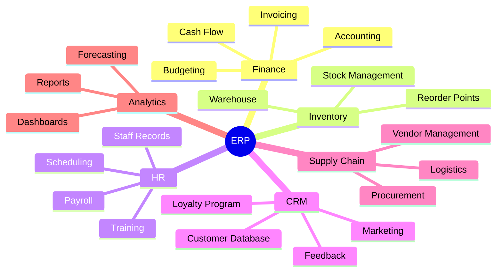
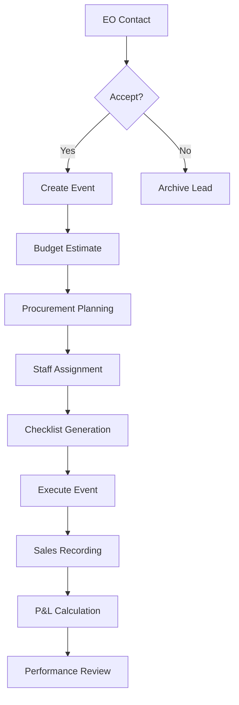
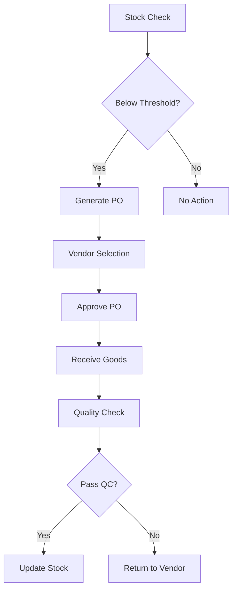
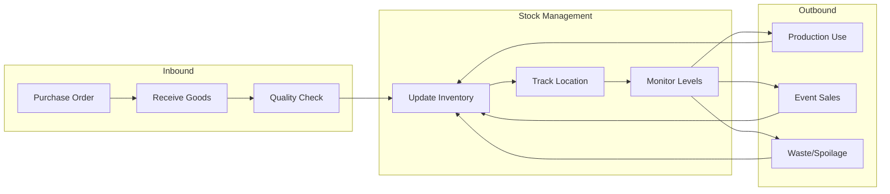
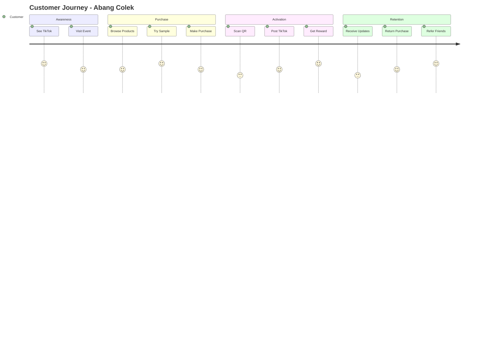
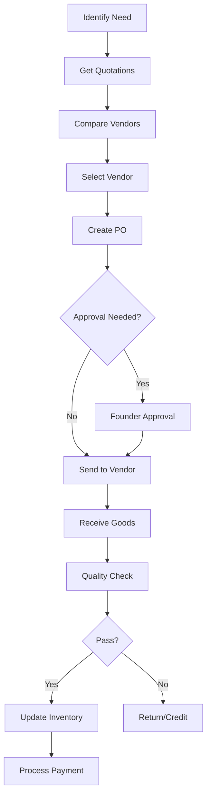
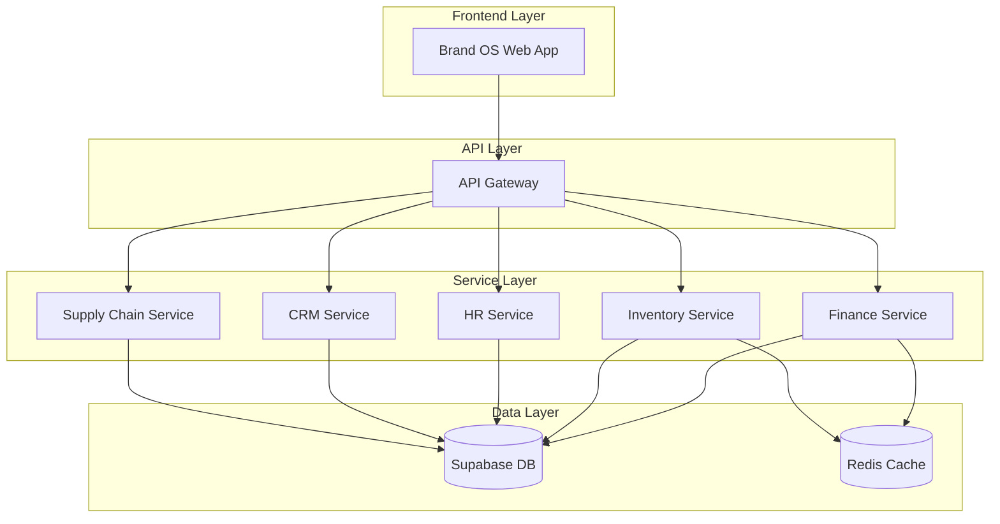

# 🌶️ ERP: Abang Colek Enterprise Resource Planning

> **"Rasa Padu, Pedas Menggamit"** - by Liurleleh House

**Version:** 1.0  
**Last Updated:** 2026-01-17  
**Status:** Planning

---

## 📋 Table of Contents

1. [Overview](#1-overview)
2. [ERP Modules](#2-erp-modules)
3. [Business Processes](#3-business-processes)
4. [Organizational Structure](#4-organizational-structure)
5. [Financial Management](#5-financial-management)
6. [Inventory Management](#6-inventory-management)
7. [Human Resources](#7-human-resources)
8. [Customer Relationship](#8-customer-relationship)
9. [Supply Chain](#9-supply-chain)
10. [Analytics & Reporting](#10-analytics--reporting)
11. [Integration Matrix](#11-integration-matrix)
12. [Implementation Roadmap](#12-implementation-roadmap)

---

## 1. Overview

### 1.1 Purpose

The Abang Colek ERP system provides a unified platform to manage all business resources, processes, and data across the organization. It integrates with the Brand OS to create a complete business management ecosystem.

### 1.2 Scope

```text
┌─────────────────────────────────────────────────────────────────────────────┐
│                        ABANG COLEK ERP ECOSYSTEM                             │
├─────────────────────────────────────────────────────────────────────────────┤
│                                                                              │
│    ┌─────────────────────────────────────────────────────────────────┐      │
│    │                      BRAND OS (Frontend)                         │      │
│    │   Dashboard │ Events │ TikTok │ Booth Ops │ Reviews │ WOCS      │      │
│    └─────────────────────────────────────────────────────────────────┘      │
│                                    │                                         │
│                                    ▼                                         │
│    ┌─────────────────────────────────────────────────────────────────┐      │
│    │                      ERP CORE (Backend)                          │      │
│    │  ┌─────────┐ ┌─────────┐ ┌─────────┐ ┌─────────┐ ┌─────────┐   │      │
│    │  │ Finance │ │Inventory│ │   HR    │ │   CRM   │ │ Supply  │   │      │
│    │  │ Module  │ │ Module  │ │ Module  │ │ Module  │ │  Chain  │   │      │
│    │  └─────────┘ └─────────┘ └─────────┘ └─────────┘ └─────────┘   │      │
│    └─────────────────────────────────────────────────────────────────┘      │
│                                    │                                         │
│                                    ▼                                         │
│    ┌─────────────────────────────────────────────────────────────────┐      │
│    │                      DATA LAYER                                  │      │
│    │            Supabase │ Analytics │ Document Storage               │      │
│    └─────────────────────────────────────────────────────────────────┘      │
│                                                                              │
└─────────────────────────────────────────────────────────────────────────────┘
```

### 1.3 Business Context

| Aspect | Current State | Target State |
| ------ | ------------- | ------------ |
| **Operations** | Manual, spreadsheet-based | Automated, centralized |
| **Financials** | Manual tracking | Real-time P&L |
| **Inventory** | Ad-hoc management | Stock alerts |
| **HR** | Informal | Structured |
| **Customer Data** | Scattered | Unified CRM |

---

## 2. ERP Modules

### 2.1 Module Overview



### 2.2 Module Details

| Module | Functions | Priority | Status |
| ------ | --------- | -------- | ------ |
| **Finance** | Accounting, P&L, Cash Flow | 🔴 Critical | Planning |
| **Inventory** | Stock, Reorder, Waste | 🔴 Critical | Planning |
| **HR** | Staff, Payroll, Schedule | 🟡 High | Planning |
| **CRM** | Customers, Loyalty | 🟡 High | Planning |
| **Supply Chain** | Vendors, Procurement | 🟢 Medium | Future |
| **Analytics** | Reports, Forecasts | 🟢 Medium | Future |

---

## 3. Business Processes

### 3.1 Core Process Map

```text
┌─────────────────────────────────────────────────────────────────────────────┐
│                           CORE BUSINESS PROCESSES                            │
├─────────────────────────────────────────────────────────────────────────────┤
│                                                                              │
│  ┌────────────────────────────────────────────────────────────────────────┐ │
│  │                    EVENT LIFECYCLE PROCESS                              │ │
│  │                                                                         │ │
│  │  Booking → Planning → Procurement → Production → Event → Review → P&L  │ │
│  │     │         │           │            │          │        │       │   │ │
│  │     ▼         ▼           ▼            ▼          ▼        ▼       ▼   │ │
│  │   CRM     Inventory   Supply Chain  HR+Ops    Booth Ops  Analytics Fin │ │
│  └────────────────────────────────────────────────────────────────────────┘ │
│                                                                              │
│  ┌────────────────────────────────────────────────────────────────────────┐ │
│  │                    PRODUCTION PROCESS                                   │ │
│  │                                                                         │ │
│  │  Recipe → Ingredients → Prep → Cooking → Packaging → QC → Distribution │ │
│  │     │          │         │        │          │        │         │      │ │
│  │     ▼          ▼         ▼        ▼          ▼        ▼         ▼      │ │
│  │   BOM     Inventory   HR/Work   Process   Inventory  QA     Logistics  │ │
│  └────────────────────────────────────────────────────────────────────────┘ │
│                                                                              │
│  ┌────────────────────────────────────────────────────────────────────────┐ │
│  │                    SALES PROCESS                                        │ │
│  │                                                                         │ │
│  │  Customer → Inquiry → Sale → Payment → Delivery → Follow-up → Loyalty  │ │
│  │     │          │        │       │         │           │          │     │ │
│  │     ▼          ▼        ▼       ▼         ▼           ▼          ▼     │ │
│  │    CRM       CRM     Finance  Finance  Logistics    CRM        CRM     │ │
│  └────────────────────────────────────────────────────────────────────────┘ │
│                                                                              │
└─────────────────────────────────────────────────────────────────────────────┘
```

### 3.2 Process Workflows

#### Event Booking Workflow



#### Inventory Replenishment Workflow



---

## 4. Organizational Structure

### 4.1 Org Chart

```text
                    ┌─────────────────┐
                    │     FOUNDER     │
                    │   (Decision)    │
                    └────────┬────────┘
                             │
         ┌───────────────────┼───────────────────┐
         │                   │                   │
┌────────▼────────┐ ┌────────▼────────┐ ┌────────▼────────┐
│    OPERATIONS   │ │    MARKETING    │ │    FINANCE      │
│     Manager     │ │     Manager     │ │     Manager     │
└────────┬────────┘ └────────┬────────┘ └────────┬────────┘
         │                   │                   │
┌────────▼────────┐ ┌────────▼────────┐ ┌────────▼────────┐
│  Booth Staff    │ │  Content Team   │ │  Accounting     │
│  Production     │ │  Social Media   │ │  Procurement    │
│  Logistics      │ │  Design         │ │                 │
└─────────────────┘ └─────────────────┘ └─────────────────┘
```

### 4.2 Role Definitions

| Role | Department | Responsibilities | System Access |
| ---- | ---------- | ---------------- | ------------- |
| **Founder** | Executive | Strategy, Approvals | Full Admin |
| **Ops Manager** | Operations | Events, Production | Ops + Finance View |
| **Marketing Manager** | Marketing | Content, Campaigns | Marketing + Analytics |
| **Finance Manager** | Finance | Accounts, Budget | Finance Full |
| **Booth Staff** | Operations | Event Execution | Booth Ops Only |
| **Content Creator** | Marketing | TikTok, IG | TikTok Engine |

---

## 5. Financial Management

### 5.1 Chart of Accounts

```text
1000 - ASSETS
├── 1100 - Current Assets
│   ├── 1110 - Cash (Bank)
│   ├── 1120 - Cash (On-hand)
│   ├── 1130 - Accounts Receivable
│   └── 1140 - Inventory
├── 1200 - Fixed Assets
│   ├── 1210 - Equipment
│   ├── 1220 - Booth Materials
│   └── 1230 - Vehicles

2000 - LIABILITIES
├── 2100 - Current Liabilities
│   ├── 2110 - Accounts Payable
│   ├── 2120 - Accrued Expenses
│   └── 2130 - Tax Payable

3000 - EQUITY
├── 3100 - Owner's Capital
└── 3200 - Retained Earnings

4000 - REVENUE
├── 4100 - Event Sales
├── 4200 - Online Sales
└── 4300 - Merchandise

5000 - EXPENSES
├── 5100 - Cost of Goods Sold
│   ├── 5110 - Raw Materials
│   └── 5120 - Packaging
├── 5200 - Operating Expenses
│   ├── 5210 - Event Fees
│   ├── 5220 - Transportation
│   ├── 5230 - Staff Wages
│   └── 5240 - Marketing
└── 5300 - Administrative
    ├── 5310 - Tools/Software
    └── 5320 - Phone/Internet
```

### 5.2 Financial Reports

| Report | Frequency | Purpose |
| ------ | --------- | ------- |
| **Event P&L** | Per event | Profitability analysis |
| **Monthly P&L** | Monthly | Overall performance |
| **Cash Flow** | Weekly | Liquidity monitoring |
| **Budget vs Actual** | Monthly | Variance analysis |
| **Expense Breakdown** | Monthly | Cost control |

### 5.3 Event P&L Template

| Category | Item | Amount |
| -------- | ---- | ------ |
| **REVENUE** | | |
| | Jumbo Colek Sales | $X,XXX |
| | Sambal Box Sales | $X,XXX |
| | Merchandise | $XXX |
| | **Total Revenue** | **$X,XXX** |
| **COGS** | | |
| | Ingredients | $XXX |
| | Packaging | $XXX |
| | **Total COGS** | **$XXX** |
| **GROSS PROFIT** | | **$X,XXX** |
| **EXPENSES** | | |
| | Event Fee | $XXX |
| | Transport | $XXX |
| | Staff Wages | $XXX |
| | Miscellaneous | $XXX |
| | **Total Expenses** | **$XXX** |
| **NET PROFIT** | | **$X,XXX** |
| **Margin %** | | **XX%** |

---

## 6. Inventory Management

### 6.1 Inventory Categories

```text
INVENTORY STRUCTURE
├── RAW MATERIALS
│   ├── Chili (Various types)
│   ├── Garlic
│   ├── Onion
│   ├── Oil
│   ├── Sugar
│   ├── Salt
│   └── Spices
│
├── PACKAGING
│   ├── Jumbo Containers
│   ├── Sambal Box Containers
│   ├── Labels
│   ├── Seals
│   └── Bags
│
├── FINISHED GOODS
│   ├── Jumbo Colek (Ready)
│   └── Sambal Box (Ready)
│
├── MERCHANDISE
│   ├── T-shirts
│   ├── Stickers
│   └── Keychains
│
└── BOOTH SUPPLIES
    ├── Spoons
    ├── Tissues
    ├── Mineral Water
    └── Sample Cups
```

### 6.2 Stock Level Parameters

| Item | Unit | Reorder Point | Max Stock | Lead Time |
| ---- | ---- | ------------- | --------- | --------- |
| Chili (Fresh) | kg | 20 | 50 | 1 day |
| Jumbo Container | pcs | 200 | 500 | 3 days |
| Labels | rolls | 5 | 20 | 7 days |
| Finished Product | units | 100 | 300 | - |

### 6.3 Inventory Tracking



---

## 7. Human Resources

### 7.1 Staff Database

| Field | Description | Required |
| ----- | ----------- | -------- |
| Staff ID | Unique identifier | Yes |
| Name | Full name | Yes |
| IC Number | Identification | Yes |
| Phone | Contact number | Yes |
| Email | Email address | No |
| Role | Job role | Yes |
| Status | Active/Inactive | Yes |
| Join Date | Start date | Yes |
| Bank Account | Salary payment | Yes |
| Emergency Contact | Emergency | Yes |

### 7.2 Payroll Structure

| Role | Type | Rate | Payment |
| ---- | ---- | ---- | ------- |
| **Booth Staff** | Hourly | RM15/hr | Per event |
| **Prep Staff** | Daily | RM80/day | Per prep |
| **Driver** | Per trip | RM100/trip | Per event |
| **Manager** | Monthly | Fixed | Monthly |

### 7.3 Event Staffing Template

| Event | Prep (1 day before) | Event Day | Teardown |
| ----- | ------------------- | --------- | -------- |
| Small | 2 prep staff | 2 booth + 1 driver | Same |
| Medium | 3 prep staff | 3 booth + 1 driver | Same |
| Large | 4 prep staff | 4 booth + 2 drivers | Same |

---

## 8. Customer Relationship

### 8.1 Customer Data Model

```text
CUSTOMER
├── customer_id (PK)
├── name
├── phone
├── email
├── tiktok_handle
├── source (event name)
├── first_purchase_date
├── total_purchases
├── total_spent
├── loyalty_tier
├── preferences
└── notes
```

### 8.2 Loyalty Program

| Tier | Requirement | Benefits |
| ---- | ----------- | -------- |
| **Bronze** | First purchase | Welcome discount |
| **Silver** | 5 purchases / RM300 | 5% off, early access |
| **Gold** | 10 purchases / RM600 | 10% off, exclusive events |
| **Platinum** | 20 purchases / RM1200 | 15% off, VIP treatment |

### 8.3 Customer Journey



---

## 9. Supply Chain

### 9.1 Vendor Management

| Vendor Type | Examples | Evaluation Criteria |
| ----------- | -------- | ------------------- |
| **Ingredients** | Chili farms, markets | Quality, Price, Reliability |
| **Packaging** | Container suppliers | MOQ, Lead time, Cost |
| **Logistics** | Transport, delivery | Availability, Rate |
| **Equipment** | Kitchen supplies | Durability, Price |

### 9.2 Procurement Process



### 9.3 Vendor Scorecard

| Metric | Weight | Score (1-5) |
| ------ | ------ | ----------- |
| Quality | 30% | |
| Price Competitiveness | 25% | |
| Delivery Reliability | 25% | |
| Payment Terms | 10% | |
| Customer Service | 10% | |
| **Total Score** | 100% | |

---

## 10. Analytics & Reporting

### 10.1 KPI Dashboard

| KPI | Formula | Target |
| --- | ------- | ------ |
| **Gross Margin** | (Revenue - COGS) / Revenue | >50% |
| **Event ROI** | Net Profit / Event Cost | >100% |
| **Customer Acquisition Cost** | Marketing Spend / New Customers | <RM10 |
| **Average Transaction Value** | Total Sales / Transactions | >RM50 |
| **Inventory Turnover** | COGS / Average Inventory | >4x/month |
| **Staff Productivity** | Sales / Staff Hours | >RM100/hr |

### 10.2 Report Types

| Report | Audience | Frequency | Format |
| ------ | -------- | --------- | ------ |
| **Executive Summary** | Founder | Weekly | Dashboard |
| **Event P&L** | Ops Manager | Per event | Document |
| **Inventory Status** | Ops Manager | Daily | Alert |
| **Sales Performance** | Marketing | Weekly | Report |
| **Staff Hours** | Finance | Bi-weekly | Spreadsheet |
| **Customer Insights** | Marketing | Monthly | Report |

### 10.3 Analytics Architecture

```text
┌─────────────────────────────────────────────────────────────────────────────┐
│                         ANALYTICS ARCHITECTURE                               │
├─────────────────────────────────────────────────────────────────────────────┤
│                                                                              │
│    DATA SOURCES                                                              │
│    ┌──────────┐ ┌──────────┐ ┌──────────┐ ┌──────────┐ ┌──────────┐        │
│    │  Events  │ │  Sales   │ │ Inventory│ │    HR    │ │  Social  │        │
│    └────┬─────┘ └────┬─────┘ └────┬─────┘ └────┬─────┘ └────┬─────┘        │
│         │            │            │            │            │               │
│         └────────────┴────────────┴────────────┴────────────┘               │
│                                   │                                          │
│                                   ▼                                          │
│    ┌─────────────────────────────────────────────────────────────────┐      │
│    │                      DATA WAREHOUSE                              │      │
│    │                       (Supabase)                                 │      │
│    └─────────────────────────────────────────────────────────────────┘      │
│                                   │                                          │
│         ┌─────────────────────────┼─────────────────────────┐               │
│         │                         │                         │               │
│         ▼                         ▼                         ▼               │
│    ┌──────────┐            ┌──────────┐            ┌──────────┐            │
│    │ Real-time│            │ Scheduled│            │  Ad-hoc  │            │
│    │Dashboards│            │ Reports  │            │ Queries  │            │
│    └──────────┘            └──────────┘            └──────────┘            │
│                                                                              │
└─────────────────────────────────────────────────────────────────────────────┘
```

---

## 11. Integration Matrix

### 11.1 System Integrations

| System A | System B | Integration Type | Data Flow |
| -------- | -------- | ---------------- | --------- |
| Brand OS | Finance | API | Sales → P&L |
| Brand OS | Inventory | API | Event → Stock |
| Brand OS | HR | API | Event → Staffing |
| Finance | Inventory | Database | COGS calculation |
| CRM | Marketing | API | Customer → Campaigns |
| Inventory | Supply Chain | Trigger | Reorder alerts |

### 11.2 Integration Architecture



---

## 12. Implementation Roadmap

### 12.1 Phase Plan

```text
Phase 1 (Q1 2026)          Phase 2 (Q2 2026)          Phase 3 (Q3 2026)
┌─────────────────┐        ┌─────────────────┐        ┌─────────────────┐
│ FOUNDATION      │        │ CORE ERP        │        │ ADVANCED        │
├─────────────────┤        ├─────────────────┤        ├─────────────────┤
│ • Brand OS MVP  │   →    │ • Finance Module│   →    │ • Full Analytics│
│ • Basic P&L     │        │ • Inventory     │        │ • CRM Complete  │
│ • Event Tracking│        │ • Staff Module  │        │ • Supply Chain  │
│ • Manual Export │        │ • Basic CRM     │        │ • Automation    │
└─────────────────┘        └─────────────────┘        └─────────────────┘
```

### 12.2 Detailed Timeline

| Phase | Module | Deliverable | Timeline |
| ----- | ------ | ----------- | -------- |
| **1.1** | Foundation | Brand OS MVP live | Week 1-4 |
| **1.2** | Finance | Event P&L tracking | Week 5-8 |
| **2.1** | Finance | Full accounting | Week 9-12 |
| **2.2** | Inventory | Stock management | Week 13-16 |
| **2.3** | HR | Staff & payroll | Week 17-20 |
| **3.1** | CRM | Customer database | Week 21-24 |
| **3.2** | Analytics | Dashboard & reports | Week 25-28 |
| **3.3** | Supply Chain | Vendor management | Week 29-32 |

### 12.3 Success Criteria

| Phase | Criteria | Measurement |
| ----- | -------- | ----------- |
| **Phase 1** | Basic operations digitized | 100% events tracked |
| **Phase 2** | Core ERP functional | P&L generated automatically |
| **Phase 3** | Full integration | Single source of truth |

---

## 📎 Appendix

### A. Glossary

| Term | Definition |
| ---- | ---------- |
| **P&L** | Profit and Loss Statement |
| **COGS** | Cost of Goods Sold |
| **SKU** | Stock Keeping Unit |
| **PO** | Purchase Order |
| **MOQ** | Minimum Order Quantity |
| **EO** | Event Organizer |

### B. Related Documents

| Document | Link |
| -------- | ---- |
| Architecture | [ARCHITECTURE.md](ARCHITECTURE.md) |
| PRD | [PRD.md](PRD.md) |
| Schemas | [SCHEMAS.md](SCHEMAS.md) |
| Brand Kit | [docs/BRANDKIT.md](docs/BRANDKIT.md) |

### C. Version History

| Version | Date | Changes |
| ------- | ---- | ------- |
| 1.0 | 2026-01-17 | Initial ERP specification |

---

*© 2026 Abang Colek by Liurleleh House. All rights reserved.*
