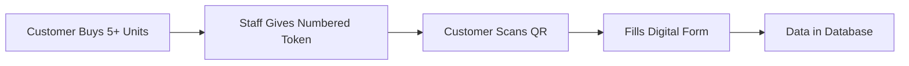
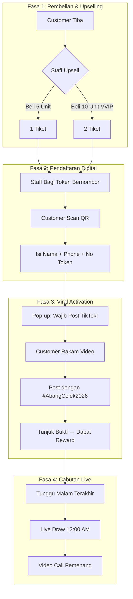
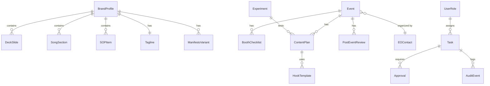

# 🌶️ PRD: Abang Colek Brand OS - Founder Suite (All-in-One)

> **"Rasa Padu, Pedas Menggamit"** - by Liurleleh House

**Version:** 1.2  
**Owner:** Founder  
**Status:** Draft  
**Last Updated:** 2026-01-16

---

## Changelog

| Version | Date | Changes |
| ------- | ---- | ------- |
| 1.2 | 2026-01-16 | Added ToC, Glossary, ERD diagram, fixed phase overlaps, added risk mitigation |
| 1.1 | 2026-01-15 | Added WOCS specification, AI Agent Hub |
| 1.0 | 2026-01-10 | Initial PRD draft |

---

## Table of Contents

1. [Context](#1-context)
2. [Purpose](#2-purpose)
3. [Goals](#3-goals)
4. [Target Users](#4-target-users)
5. [Key Problems](#5-key-problems)
6. [Solution Overview](#6-solution-overview)
7. [Core Features](#7-core-features-must-have)
8. [Advanced Tools](#8-advanced-tools-all-in-one)
9. [UX/UI Principles](#9-uxui-principles)
10. [Data Model](#10-data-model-high-level)
11. [Workflows](#11-workflows)
12. [Requirements](#12-requirements)
13. [Telemetry and Events](#13-telemetry-and-events)
14. [Risks](#14-risks)
15. [Implementation Phases](#15-implementation-phases)
16. [Budget Ranges](#16-budget-ranges-indicative-tbd)
17. [Delivery Roadmap](#17-delivery-roadmap)
18. [Success Metrics](#18-success-metrics-initial-defaults-tbd)
19. [Integration Ideas](#19-integration-ideas-optional-future)
20. [User Enablement Ideas](#20-user-enablement-ideas)
21. [Open Questions](#21-open-questions)
22. [Glossary](#22-glossary)

---

## 1. Context

- Event-driven street food brand across Malaysia (including Sabah and Sarawak), plus Singapore and Brunei.
- Schedule depends on EO pipeline; minimum 1 to 2 events per month.
- Current operation is 1-man show.
- Primary growth channel: TikTok only.
- No current integrations (POS, inventory, CRM, analytics).
- Required access model: owner (manager) plus founder access for monitoring and approvals.
- Delivery target: Web app + mobile PWA.

## 2. Purpose

Build a comprehensive, advanced, all-in-one Founder Suite that turns brand strategy into daily execution for an event-based business. The product must help the founder plan, run, and review events, manage booth ops, produce TikTok content, and build brand assets from one place.

## 3. Goals

- Reduce founder workload by standardizing event ops and content workflows.
- Centralize all brand artifacts (deck, manifesto, SOP, song, content playbooks) with versioning.
- Enable rapid event preparation and post-event review without losing context.
- Provide a single source of truth for brand, ops, and growth decisions.
- Support eventual scaling to crew and franchise readiness.
- Enable shared access where owner manages operations and founder monitors progress.

Non-goals (v1):

- Full CRM replacement
- Full accounting or POS integration

## 4. Target Users

Primary:

- Founder/Owner (solo operator, fast iteration)

Secondary (future):

- Content helper
- Booth crew
- Ops coordinator
- Business manager (owner/administrator role)

## 5. Key Problems

- Event schedule is unpredictable; planning is ad-hoc.
- Booth setup, prep, and logistics are not standardized.
- Content output depends on founder memory, not systems.
- No unified place to track what worked per event.

## 6. Solution Overview

Expand the current Brand OS into a Founder Suite with **11 integrated modules**:

1) Strategy Core
2) Event Pipeline
3) Booth Ops
4) TikTok Content Engine
5) Growth Experiments
6) Performance Dashboard
7) Asset and Export Center
8) Team Workflow
9) Compliance and Risk
10) Admin AI Agent Hub

## 7. Core Features (Must Have)

### 7.1 Strategy Core

- Brand Manifesto editor with variants and approvals
- Tagline and Offer library (primary + alternatives)
- Brand DNA: tone, personality, values, taboos
- Deck builder with slide sequencing and notes
- SOP library with schedules and responsibilities

### 7.2 Event Pipeline

- EO contact and lead pipeline
- Event calendar with location, dates, fees, and requirements
- Event checklist (permits, logistics, menu, pricing)
- Contract and pricing notes

### 7.3 Booth Ops

- Booth setup checklist with photos and layout
- Prep list (ingredients, equipment, consumables)
- Vendor and supplier directory
- Travel and logistics plan per event

### 7.4 TikTok Content Engine

- Content calendar tied to events
- Hook and script templates for street reaction videos
- Shot list per event day
- Caption and hashtag bank
- Posting cadence tracker

### 7.5 Growth Experiments

- Experiment builder (hypothesis, metric, target)
- A/B test for hooks, taglines, CTA
- Experiment tracker with outcome summary

### 7.6 Performance Dashboard

- Event performance snapshots (sales, footfall, ROI)
- Content performance (views, watch time, comments)
- Weekly summary auto-generated

### 7.7 Asset and Export Center

- Exports: JSON, Markdown, PDF deck
- TikTok content pack export (captions, hooks, thumbnails)
- Press kit export (brand story, logo usage)

### 7.8 Team Workflow

- Roles and permissions (Owner/Admin, Founder/Approver, Editor, Viewer)
- Change history with diff view
- Approval workflow for key assets
- Monitoring dashboard for Founder (read-only KPIs + approvals)

### 7.9 Compliance and Risk

- Backup and recovery
- Audit trail for changes
- Risk log for event issues and mitigations

### 7.10 Admin AI Agent Hub

- Admin AI agent with full access to manage tasks, generate assets, and enforce SOPs
- Task queue with approvals (auto-prepare, founder approves)
- Automated checklists and reminders (pre-event, event-day, post-event)

### 7.11 WhatsApp OPS Control System (WOCS)

**Full specification: [docs/WOCS_SPEC.md](docs/WOCS_SPEC.md)**

Core Concept: WhatsApp = Command Center for all operations.

- **Command-Based Control**: Admin sends structured commands via WhatsApp
- **Task Engine**: Queue-based task processing with priority and retry
- **Multi-Executor Support**:
  - Agent task assignment and tracking
  - Landing page CMS updates (auto)
  - Web app config changes (auto)
  - TikTok content posting (semi-auto)
  - Content scheduling (auto)
- **Voice Commands**: Voice notes transcribed via Whisper → commands
- **Real-time Feedback**: Status updates back to WhatsApp
- **Agent Panel**: Web UI for task approval and execution
- **Security**: Whitelist, rate limiting, audit trail
- **Rollback**: Undo any task with full version history

Key Commands:

```text
/agent task to:ali type:followup target:019xxx
/landing create page:promo-raya title:Promo Raya!
/tiktok post caption:Pedas ni jujur 🔥
/report daily date:today
```

### 7.12 Lucky Draw Campaign System (Event-Based Promotions)

A modern, digital-first lucky draw system designed for 2026 events. Replaces traditional paper-based entry with QR code registration and viral TikTok integration.

#### 7.12.1 Campaign Structure

##### Products and Pricing (MAKAN FEST Brunei)

| Product | Price | Notes |
| ------- | ----- | ----- |
| Jumbo Colek | BND 15 | Mix & match allowed |
| Sambal Box | BND 15 | Mix & match allowed |

**Ticket Mechanics (5:1 Rule)**

| Purchase | Tickets | Status |
| -------- | ------- | ------ |
| 5 units (BND 75) | 1 ticket | Standard entry |
| 10 units (BND 150) | 2 tickets | VVIP status |

- Maximum purchase: 10 units per person
- Maximum tickets: 2 per person (fair chance for all)

##### Prize Pool

| Prize | Item | Color |
| ----- | ---- | ----- |
| Grand Prize | iPhone 16 Pro Max | Desert Titanium |
| 2nd Prize | iPad 10th Generation | Blue |

#### 7.12.2 Digital Registration Flow (No POS Required)

Since operations are manual (no POS/receipt machine), use **Numbered Token Cards**:

1. **Pre-print** numbered cards (001, 002, 003...) OR use cheap numbered receipt book (RM2)
2. Staff gives token card to qualifying customer (min 5 units)
3. Customer scans **Static QR Code** at standee
4. Customer enters: Name, Phone, Token Number
5. Data flows to Google Sheets/database automatically



#### 7.12.3 Viral TikTok Integration (Free Marketing)

**Activation Requirement**: To "activate" lucky draw ticket, customer MUST post TikTok video.

**Video Requirements**:

- Must show product (Jumbo Colek / Sambal Box)
- Must tag: **@styloairpool**
- Must use hashtag: **#AbangColek2026** **#MakanFest**
- Bonus hashtags: #JumboColekPadu #ColekSampaiLicin #PedasGila

**Instant Reward**: After posting & showing proof to staff:

- Free mineral water, OR
- $2 voucher for next purchase, OR
- Small merchandise (keychain/sticker)

#### 7.12.4 Customer Journey Map



#### 7.12.5 Upselling Strategy (Staff Training)

**Script Templates for Staff**:

| Scenario | Script |
| -------- | ------ |
| Customer wants 1-2 units | "Bang, tambah sikit je cukupkan 5. Boleh join Lucky Draw iPhone 17!" |
| Customer at 5 units | "Alang-alang 10 terus jadi VVIP! Peluang menang double!" |
| Customer says "mahal" | "Bukan mahal bang, tu pelaburan. Kalau menang iPhone 17 tu berbaloi!" |

**Psychology Techniques**:

- **FOMO**: "Ramai dah join, tinggal sikit je tiket"
- **Scarcity**: "Stok tinggal 20 je lagi"
- **Social Proof**: "Tadi ada family ambil 10 terus"

#### 7.12.6 Draw Execution (Transparency)

**Method**: Digital Randomizer displayed on big screen

1. Use "Wheel of Names" or random picker software
2. All registered names visible on screen (transparency)
3. Live stream the draw on TikTok/Instagram
4. Video call winner immediately for verification
5. Winner must show token card as proof

#### 7.12.7 AI Tools for Staff (Future Enhancement)

| Tool | Function |
| ---- | -------- |
| **Upsell Script Generator** | AI generates persuasive scripts based on customer type |
| **TikTok Content Ideas** | AI suggests video concepts and captions for customers |
| **Objection Handler** | AI provides responses to customer objections |

#### 7.12.8 Post-Campaign Data Usage

Database collected becomes valuable marketing asset:

- WhatsApp broadcast for future events
- Retargeting for new product launches
- Loyalty program enrollment
- Birthday/anniversary promos

## 8. Advanced Tools (All-in-One)

### 8.1 Architecture and Design Toolkit

- Microservices and modular monolith scaffolding guides
- Event-driven patterns for content tracking
- Contract-first specs (OpenAPI/AsyncAPI)
- Architecture docs generator (C4, ADR)
- Domain-driven design templates for brand entities
- API gateway patterns for future integrations

### 8.2 Security and Compliance Toolkit

- OWASP checklist for web app
- Secrets and access management guidance
- Audit logging and evidence pack generation
- PDPA (Malaysia) compliance checklist
- Data encryption at rest and in transit patterns
- Session management and token rotation

### 8.3 DevOps and Infrastructure Toolkit

- CI/CD templates for frontend and backend
- IaC templates for AWS an multi-region readiness
- Observability stack setup (metrics, logs, tracing)
- Blue-green and canary deployment patterns
- Auto-scaling configurations for event peaks
- Disaster recovery and backup automation

### 8.4 Data and Analytics Toolkit

- Event schema for content, assets, and experiments
- Data quality checks and anomaly detection
- Dashboard templates for KPIs and cohorts
- Real-time analytics pipeline (streaming events)
- Data warehouse schema for historical analysis
- Predictive models for event performance

### 8.5 Testing and Quality Toolkit

- Snapshot tests for exports
- Regression tests for data transforms
- Performance test scenarios for large datasets
- E2E testing with Playwright for critical flows
- Visual regression testing for UI consistency
- Chaos engineering for resilience testing

### 8.6 Code Generation and Scaffolding Toolkit

- CRUD generators for assets and experiments
- Export format templates
- GraphQL or REST schema generators
- React component generators with TypeScript
- Database migration generators
- API client SDK generators

### 8.7 Maintenance and Optimization Toolkit

- Dependency update playbook
- Performance profiling and caching guidance
- Refactor and technical debt checklist
- Memory leak detection patterns
- Bundle size optimization strategies
- Database query optimization

### 8.8 Documentation and Knowledge Toolkit

- Auto-runbook generator
- Onboarding checklist
- Changelog and release notes templates
- API documentation with examples
- Video tutorial script generator
- FAQ and troubleshooting generator

### 8.9 AI-Powered Content Tools

- **AI Caption Generator**: Auto-generate TikTok captions from video context
- **Hook Optimizer**: AI suggests hook improvements based on performance data
- **Hashtag Recommender**: Trending hashtag suggestions for Malaysian market
- **Script Writer**: Generate reaction video scripts from templates
- **Thumbnail Generator**: AI-powered thumbnail suggestions
- **Sentiment Analyzer**: Analyze comments for brand perception
- **Competitor Tracker**: AI monitors competitor content strategies

### 8.10 Automation and Workflow Engine

- **Event Auto-Prep**: Auto-generate checklists when event is confirmed
- **Content Calendar Sync**: Auto-populate content slots based on event dates
- **Reminder Engine**: WhatsApp/Telegram reminders for prep deadlines
- **Post-Event Report Generator**: Auto-summarize metrics into reports
- **Approval Workflow Automation**: Route assets for founder approval
- **Inventory Alert System**: Low stock notifications before events
- **Weather Integration**: Alert if weather affects outdoor events

### 8.11 Integration Connectors

- **TikTok Business API**: Post scheduling, analytics pull, comment management
- **Google Workspace**: Calendar sync, Drive backup, Sheets export
- **WhatsApp Business API**: Customer comms, EO follow-ups
- **Payment Gateways**: DuitNow, Touch n Go, GrabPay tracking
- **Accounting**: Basic invoice generation, expense tracking
- **Maps API**: Event location mapping, travel time calculation
- **Weather API**: Event day weather forecasting

### 8.12 Mobile-First Tools

- **Quick Capture**: One-tap photo/video capture with auto-tagging
- **Voice Notes**: Record and transcribe event observations
- **Offline Mode**: Full functionality without internet
- **QR Code Scanner**: Quick inventory and asset tracking
- **Location Check-in**: Auto-log arrival at event venues
- **Real-time Sales Tracker**: Manual entry with running totals

### 8.13 Analytics and Intelligence

- **Event ROI Calculator**: Revenue vs costs per event
- **Content Performance Heatmap**: Best performing content types/times
- **Audience Insights**: Demographics and engagement patterns
- **Trend Detector**: Identify emerging food trends
- **Forecast Engine**: Predict event performance based on history
- **A/B Test Analyzer**: Statistical significance calculator

### 8.14 Brand Asset Management

- **Logo Variation Manager**: Store and version all logo formats
- **Color Palette Enforcer**: Ensure brand consistency
- **Font Library**: Approved fonts with usage guidelines
- **Photo Asset Library**: Organized by event, product, vibe
- **Video Clip Library**: Searchable reaction clips
- **Template Gallery**: Pre-approved post templates

### 8.15 Knowledge Base and Training

- **SOP Video Library**: Visual guides for booth setup
- **Recipe Database**: Standardized recipes with scaling
- **Vendor Directory**: Rated suppliers with contact info
- **Pricing Calculator**: Dynamic pricing based on location/event type
- **FAQ Bot**: Auto-answer common customer questions
- **Crew Training Modules**: Onboarding checklists for future team

## 9. UX / UI Principles

- Minimal clicks to reach daily actions
- Founder-first layout with clear next steps
- Clear status: draft vs approved vs archived
- Smart defaults and guided flows
- Mobile-first flows for on-site event usage (PWA)
- Offline-first UX with local cache and sync queue

## 10. Data Model (High Level)

### Entity Relationship Diagram



### Entities by Category

#### Brand Assets

- BrandProfile, DeckSlide, SongSection, SOPItem, Tagline, ManifestoVariant

#### Event Operations

- Event, EOContact, BoothChecklist, PrepItem, Supplier, TravelPlan

#### Content and TikTok

- HookTemplate, ContentPlan, ContentPost, Experiment

#### Analytics and Reports

- Metric, Report, PostEventReview

#### System and Workflow

- UserRole, Task, Approval, AuditEvent, Integration

## 11. Workflows

### 11.1 Weekly Event Planning

1. Review EO pipeline and confirm events
2. Generate booth checklist and prep list
3. Build TikTok shot list and schedule
4. Export event pack
5. Post-event review and notes

### 11.2 New Hook Experiment

1. Draft hook variants
2. Create experiment
3. Assign to event content schedule
4. Measure outcomes
5. Promote winner to template library

## 12. Requirements

Functional:

- Offline-first editing with local storage fallback
- Export pack generator (JSON/MD/PDF)
- Role-based access control (Owner/Admin, Founder/Approver, Editor, Viewer)
- PWA support (offline mode, installable, background sync)

Non-functional:

- Fast load under 2s for typical dataset
- Reliable autosave with no data loss
- Mobile responsive

## 13. Telemetry and Events

- event_created
- event_completed
- content_posted
- export_triggered
- experiment_started
- experiment_completed
- task_created
- task_completed
- approval_requested
- approval_granted

## 14. Risks

| Risk | Impact | Mitigation |
| ---- | ------ | ---------- |
| Scope creep (too many tools) | High | Phase delivery, MVP first |
| Founder overload | Medium | Clear prioritization, automation |
| Data quality issues | Medium | Validation, smart defaults |
| Event schedule volatility | Low | Flexible planning, quick prep |
| Tech debt accumulation | Medium | Regular refactoring, code review |

## 15. Implementation Phases

Phase 0: Foundation (Weeks 1-2)

- Stabilize current editor and exports
- Add backup and recovery defaults
- Clean up data model and validation

Phase 1: Event and Booth Ops (Weeks 3-6)

- Event pipeline, calendar, EO contacts
- Booth checklist, prep list, travel plan
- Event pack export

Phase 2: TikTok Content Engine (Weeks 7-10)

- Content calendar with cadence rules
- Hook and script templates
- Posting tracker and performance notes

Phase 3: Performance and Experiments (Weeks 11-14)

- KPI dashboard and trends
- A/B testing for hooks and CTA
- Weekly founder report

Phase 4: Team Workflow and Scale (Weeks 15-18)

- Roles and approvals
- Audit trail and history
- Handoff workflows for crew

Phase 5: PWA and Mobile Ops (Weeks 19-22)

- PWA install, offline mode, sync queue
- Event-day quick actions and checklist UI

Phase 6: Advanced Toolkits Integration (Weeks 23-26)

- Integrate toolkits, automation, and documentation packs

Phase 7: Admin AI Agent Hub (Weeks 27-30)

- Admin AI agent task orchestration
- Auto-generated checklists and reports
- Approval gates for founder

## 16. Budget Ranges (Indicative, TBD)

- DIY/No-budget: RM0 to RM5k (founder only, minimal automation)
- Lean Build: RM10k to RM30k (MVP modules, basic UI/UX)
- Growth Build: RM50k to RM150k (full modules, dashboards, automation)
- Scale Build: RM150k+ (advanced toolkits, integrations, multi-tenant)

## 17. Delivery Roadmap

- Month 1: Foundation + Event Ops
- Month 2: Booth Ops + TikTok Engine
- Month 3: Performance + Experiments
- Month 4-5: Team Workflow + Audit
- Month 6-7: PWA + Advanced Toolkits + Admin AI Agent

## 18. Success Metrics (Initial Defaults, TBD)

- Events executed per month (min 1 to 2)
- Event prep time reduced by 30-50 percent
- TikTok outputs per event (target 10 to 20 clips)
- Weekly founder time saved

## 19. Integration Ideas (Optional, Future)

- TikTok analytics (when API access is available)
- Google Drive for asset backups
- Google Calendar for event scheduling
- WhatsApp Business for quick comms templates
- Notion or Google Sheets for external sharing
- Email (Gmail) for EO communication logs

## 20. User Enablement Ideas

- Daily action list (auto-generated from events and content plans)
- One-click event pack creation (checklist + shot list + CTA bank)
- Post-event review prompts (5 data points only)
- Founder monitoring view with approvals and alerts

## 21. Open Questions

| Question | Status | Notes |
| -------- | ------ | ----- |
| Minimum data to log per event? | Pending | 5 fields recommended |
| Revenue tracking without POS? | Pending | Manual entry or photo of receipt |
| Post-event reporting effort? | Pending | Target <5 mins |
| AI features priority? | Pending | Caption generator first |
| Multi-brand support? | Deferred | Not in v1 scope |

---

## 22. Glossary

| Term | Definition |
| ---- | ---------- |
| **EO** | Event Organizer - company/person that organizes events |
| **WOCS** | WhatsApp OPS Control System - WhatsApp command interface |
| **PWA** | Progressive Web App - installable web app with offline support |
| **Hook** | Opening line/scene in TikTok video to grab attention |
| **CTA** | Call To Action - prompt for viewer action |
| **KPI** | Key Performance Indicator - measurable success metric |
| **ERD** | Entity Relationship Diagram - data model visualization |
| **MVP** | Minimum Viable Product - first working version |
| **SOP** | Standard Operating Procedure - documented workflow |
| **ROI** | Return On Investment - revenue vs cost ratio |
